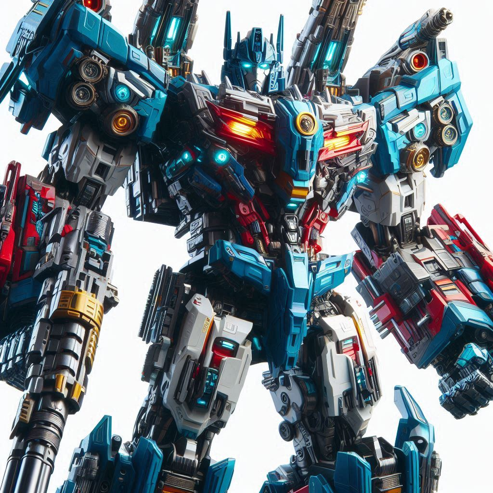
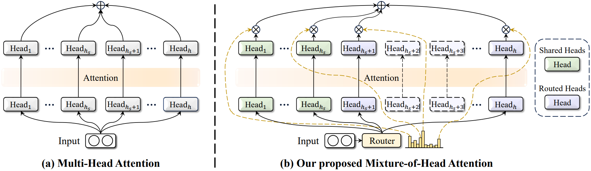
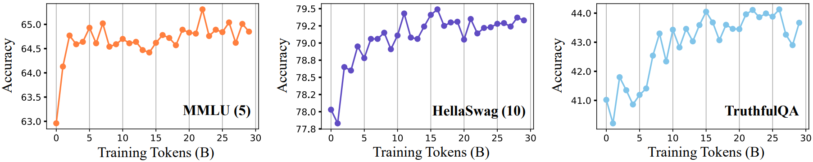
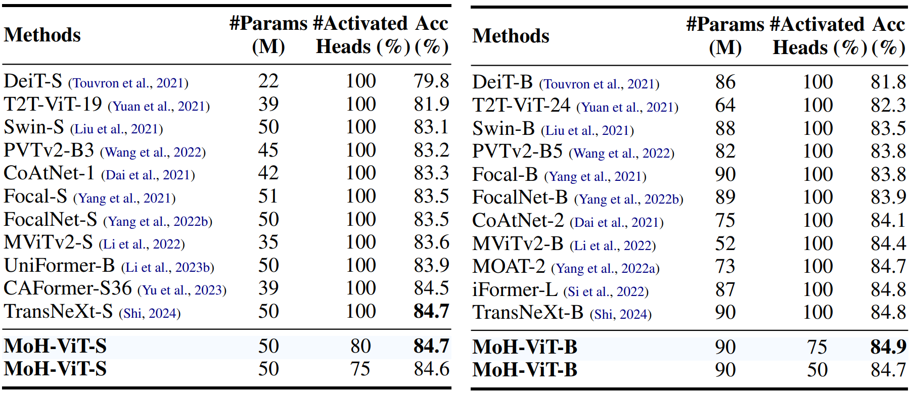
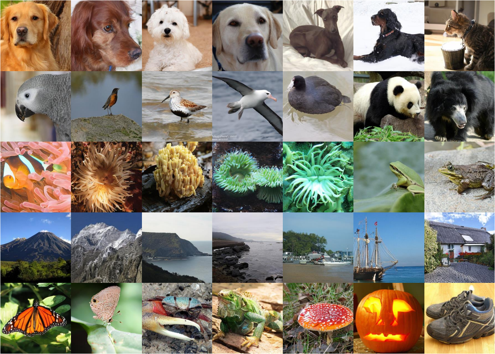
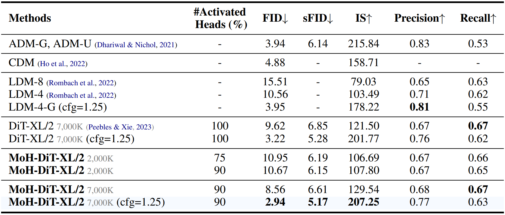
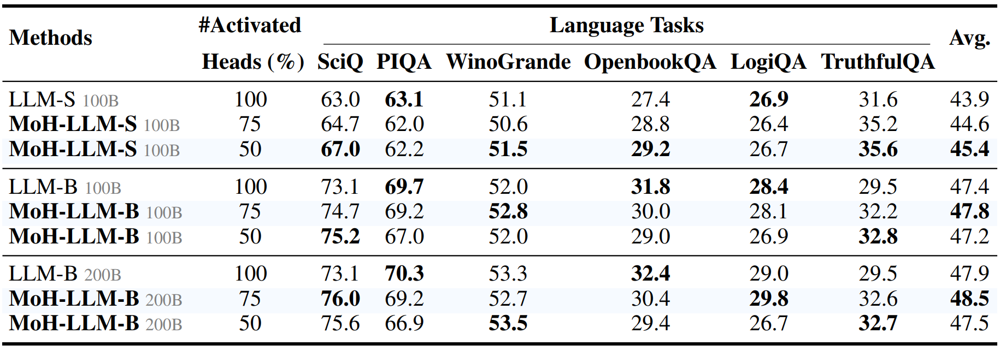
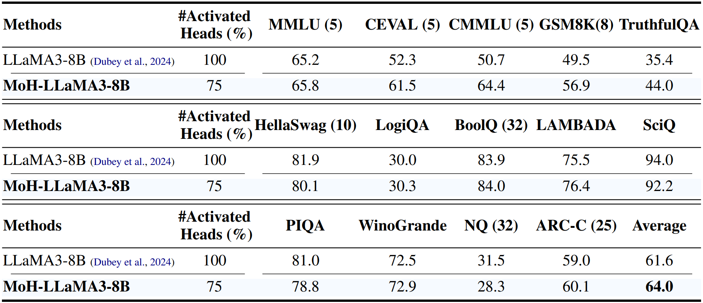
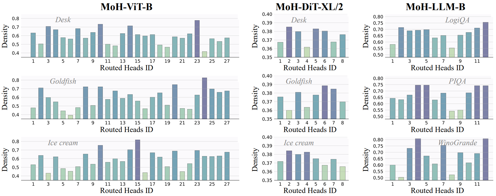

<div align=center>

</div>

<h2 align="center"> <a href="https://arxiv.org/abs/2410.11842">MoH: Multi-Head Attention as Mixture-of-Head Attention

</a></h2>
<h5 align="center"> If you like our project, please give us a star ⭐ on GitHub for the latest update.</h5>

<h5 align=center>

<!-- [](https://huggingface.co/spaces/Chat-UniVi/Chat-UniVi) -->
[](https://huggingface.co/Chat-UniVi)
[](https://arxiv.org/abs/2410.11842)
[](https://github.com/SkyworkAI/MoH/blob/main/LICENSE)
[](https://hits.seeyoufarm.com)
[](https://github.com/SkyworkAI/MoH/issues?q=is%3Aopen+is%3Aissue)
[](https://github.com/SkyworkAI/MoH/issues?q=is%3Aissue+is%3Aclosed)
</h5>

<details open><summary>💡 I also have other projects that may interest you ✨. </summary><p>
<!--  may -->
    
> [**Chat-UniVi: Unified Visual Representation Empowers Large Language Models with Image and Video Understanding**](https://arxiv.org/abs/2311.08046) <br>
> Peng Jin, Ryuichi Takanobu, Wancai Zhang, Xiaochun Cao, Li Yuan <br>
[](https://github.com/PKU-YuanGroup/Chat-UniVi)  [](https://github.com/PKU-YuanGroup/Chat-UniVi) [](https://arxiv.org/abs/2311.08046) [-FFD93D.svg)](https://cvpr.thecvf.com/) <br>
    
> [**MoE++: Accelerating Mixture-of-Experts Methods with Zero-Computation Experts**](https://github.com/SkyworkAI/MoE-plus-plus) <br>
> Peng Jin, Bo Zhu, Li Yuan, Shuicheng Yan <br>
[](https://github.com/SkyworkAI/MoE-plus-plus)  [](https://github.com/SkyworkAI/MoE-plus-plus) [](https://arxiv.org/abs/2410.07348) <br>

-->

</p></details>

## 📣 News
* **[2024/10/10]**  MoH-LLaMA3-8B weights are being approved and will be available for download after approval.
* **[2024/10/09]**  Model weight and inference code are available now! Welcome to **watch** 👀 this repository for the latest updates.

## ⚡ Overview
We propose Mixture-of-Head attention (MoH), a new architecture that treats attention heads as experts in the Mixture-of-Experts (MoE) mechanism. MoH has two significant advantages:
* First, MoH enables each token to select the appropriate attention heads, enhancing inference efficiency without compromising accuracy or increasing the number of parameters. 
* Second, MoH replaces the standard summation in multi-head attention with a weighted summation, introducing flexibility to the attention mechanism and unlocking extra performance potential.

<div align=center>

</div>


## 😮 Highlights
### 💡 General Framework
We evaluate our proposed MoH across various popular model frameworks, including Vision Transformers (ViT) for image classification, Diffusion models with Transformers (DiT) for class-conditional image generation, and Large Language Models (LLMs) for language tasks.

<div align=center>

|                   Code                    |                                                                                                                         HuggingFace Model                                                                                                                         |  
|:-----------------------------------------:|:-----------------------------------------------------------------------------------------------------------------------------------------------------------------------------------------------------------------------------------------------------------------:|
|     **[MoH-ViT](https://github.com/SkyworkAI/MoH/tree/main/MoH-ViT)**      | 🤗 [MoH-ViT-B-75](https://huggingface.co/Chat-UniVi/MoH-ViT-B-75), [MoH-ViT-B-50](https://huggingface.co/Chat-UniVi/MoH-ViT-B-50), [MoH-ViT-S-80](https://huggingface.co/Chat-UniVi/MoH-ViT-S-80), [MoH-ViT-S-75](https://huggingface.co/Chat-UniVi/MoH-ViT-S-75) |
|     **[MoH-DiT](https://github.com/SkyworkAI/MoH/tree/main/MoH-DiT)**      |                                                                                                 😊 [MoH-DiT-90](https://huggingface.co/Chat-UniVi/MoH-DiT-XL-90)                                                                                                  | 
| **[MoH-LLaMA3-8B](https://github.com/SkyworkAI/MoH/tree/main/MoH-LLaMA3)** |                                                                                                                        😊 [MoH-LLaMA3-8B](https://huggingface.co/Chat-UniVi/MoH-LLaMA3-8B)                                                                                                                         | 

</div>

### 🔥 High Performance
Extensive experiments on ViT, DiT, and LLMs demonstrate that MoH outperforms multi-head attention by using only **50%~90%** of the attention heads.

### 🤗 Support Continue-Tuning Starting from the Multi-Head Attention Models
We demonstrate that pre-trained multi-head attention models, such as LLaMA3-8B, can be further continue-tuned into our MoH models. Notably, MoH-LLaMA3-8B achieves an average accuracy of 64.0% across 14 benchmarks, outperforming LLaMA3-8B by 2.4% by utilizing only 75% of the attention heads.

<div align=center>

</div>

The MoH model quickly recovers to over **95%** of the performance of the original model within a training budget of 10B tokens. Then, the performance gradually improves with the increase of the training tokens.

## 🚀 Main Results
### ViT for ImageNet-1K Classification

<div align=center>

</div>

### DiT for Class-Conditional Image Generation (ImageNet-1K)

<div align=center>

</div>

<div align=center>

</div>

### Training LLMs from Scratch

<div align=center>

</div>

### Continue-Tuning LLaMA3-8B

<div align=center>

</div>


## 😍 Why is MoH better than Multi-Head Attention?
### Flexible Head Assignment Patterns
We observe significant variation in attention head assignments across different categories and task topics, indicating that the MoH model adapts to diverse tasks by employing distinct head assignment patterns. This characteristic of MoH allows different attention heads to focus on different types of tasks, making parameter utilization more efficient than multi-head attention.

<div align=center>

</div>

### Weighted Summation of Heads
By replacing the standard summation in multi-head attention with a weighted summation, MoH enhances the flexibility of the attention mechanism and increases the performance potential.


## 🗝️ Training & Validating
* The training instruction of MoH-ViT is in [MoH-ViT](MoH-ViT/README.md).
* The training instruction of MoH-DiT is in [MoH-DiT](MoH-DiT/README.md).
* The instruction of MoH-LLaMA-8B is in [MoH-LLaMA-8B](MoH-LLaMA3/README.md).


## 👍 Acknowledgement
* [Skywork-MoE](https://github.com/SkyworkAI/Skywork-MoE) It is an advanced MoE language model.
* [LLaMA3](https://github.com/meta-llama/llama3) It is an advanced open-source language model.
* [TransNeXt (CVPR 2024)](https://github.com/DaiShiResearch/TransNeXt) It is an advanced ViT model.
* [DiT (ICCV 2023)](https://github.com/facebookresearch/DiT) It is an advanced diffusion model with the Transformer.

## 🤝 Related Projects
* [MoE++](https://github.com/SkyworkAI/MoE-plus-plus) MoE++ achieves better performance while delivering 1.1~2.1x expert forward throughput compared to a vanilla MoE model of the same size, which lays a solid foundation for developing advanced and efficient MoE-related models.
* [Chat-UniVi (CVPR 2024 Highlight)](https://github.com/PKU-YuanGroup/Chat-UniVi) The model is an efficient large language and video assistant. This framework exhibits remarkable interactive capabilities between images and videos.


## 🔒 License
* The majority of this project is released under the Apache 2.0 license as found in the [LICENSE](https://github.com/SkyworkAI/MoH/blob/main/LICENSE) file.
* The service is a research preview intended for non-commercial use only, subject to the model [License](https://github.com/facebookresearch/llama/blob/main/MODEL_CARD.md) of LLaMA, [Terms of Use](https://openai.com/policies/terms-of-use) of the data generated by OpenAI, and [Privacy Practices](https://chrome.google.com/webstore/detail/sharegpt-share-your-chatg/daiacboceoaocpibfodeljbdfacokfjb) of ShareGPT. Please contact us if you find any potential violations.


## ✏️ Citation
If you find this paper useful, please consider staring 🌟 this repo and citing 📑 our paper:
```
@article{jin2024moh,
  title={MoH: Multi-Head Attention as Mixture-of-Head Attention}, 
  author={Peng Jin and Bo Zhu and Li Yuan and Shuicheng Yan},
  year={2024}
}
```

## ✨ Contributors
<a href="https://github.com/SkyworkAI/MoH/graphs/contributors">
  
</a>
